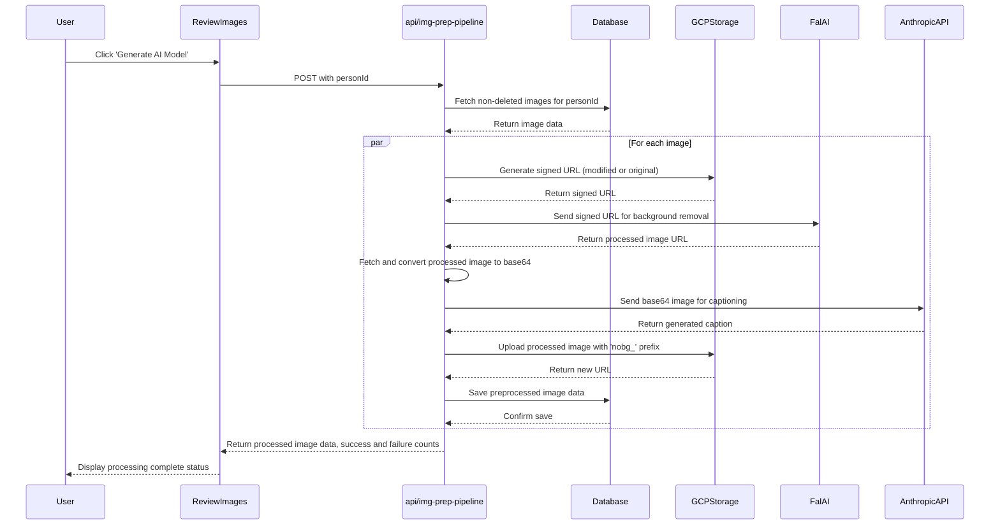

```mermaid
sequenceDiagram
    participant User
    participant ReviewImages
    participant api/img-prep-pipeline
    participant Database
    participant GCPStorage
    participant FalAI
    participant AnthropicAPI

    User->>ReviewImages: Click 'Generate AI Model'
    ReviewImages->>api/img-prep-pipeline: POST with personId
    api/img-prep-pipeline->>Database: Fetch non-deleted images for personId
    Database-->>api/img-prep-pipeline: Return image data

    par For each image
        api/img-prep-pipeline->>GCPStorage: Generate signed URL (modified or original)
        GCPStorage-->>api/img-prep-pipeline: Return signed URL
        api/img-prep-pipeline->>FalAI: Send signed URL for background removal
        FalAI-->>api/img-prep-pipeline: Return processed image URL
        api/img-prep-pipeline->>api/img-prep-pipeline: Fetch and convert processed image to base64
        api/img-prep-pipeline->>AnthropicAPI: Send base64 image for captioning
        AnthropicAPI-->>api/img-prep-pipeline: Return generated caption
        api/img-prep-pipeline->>GCPStorage: Upload processed image with 'nobg_' prefix
        GCPStorage-->>api/img-prep-pipeline: Return new URL
        api/img-prep-pipeline->>Database: Save preprocessed image data
        Database-->>api/img-prep-pipeline: Confirm save
    end

    api/img-prep-pipeline-->>ReviewImages: Return processed image data, success and failure counts
    ReviewImages-->>User: Display processing complete status
```