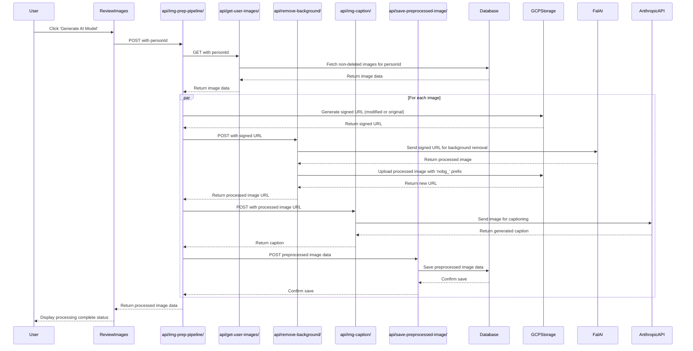

```mermaid
sequenceDiagram
    participant User
    participant ReviewImages
    participant api/img-prep-pipeline/
    participant api/get-user-images/
    participant api/remove-background/
    participant api/img-caption/
    participant api/save-preprocessed-image/
    participant Database
    participant GCPStorage
    participant FalAI
    participant AnthropicAPI

    User->>ReviewImages: Click 'Generate AI Model'
    ReviewImages->>api/img-prep-pipeline/: POST with personId
    api/img-prep-pipeline/->>api/get-user-images/: GET with personId
    api/get-user-images/->>Database: Fetch non-deleted images for personId
    Database-->>api/get-user-images/: Return image data
    api/get-user-images/-->>api/img-prep-pipeline/: Return image data

    par For each image
        api/img-prep-pipeline/->>GCPStorage: Generate signed URL (modified or original)
        GCPStorage-->>api/img-prep-pipeline/: Return signed URL
        api/img-prep-pipeline/->>api/remove-background/: POST with signed URL
        api/remove-background/->>FalAI: Send signed URL for background removal
        FalAI-->>api/remove-background/: Return processed image
        api/remove-background/->>GCPStorage: Upload processed image with 'nobg_' prefix
        GCPStorage-->>api/remove-background/: Return new URL
        api/remove-background/-->>api/img-prep-pipeline/: Return processed image URL

        api/img-prep-pipeline/->>api/img-caption/: POST with processed image URL
        api/img-caption/->>AnthropicAPI: Send image for captioning
        AnthropicAPI-->>api/img-caption/: Return generated caption
        api/img-caption/-->>api/img-prep-pipeline/: Return caption

        api/img-prep-pipeline/->>api/save-preprocessed-image/: POST preprocessed image data
        api/save-preprocessed-image/->>Database: Save preprocessed image data
        Database-->>api/save-preprocessed-image/: Confirm save
        api/save-preprocessed-image/-->>api/img-prep-pipeline/: Confirm save
    end

    api/img-prep-pipeline/-->>ReviewImages: Return processed image data
    ReviewImages-->>User: Display processing complete status
```