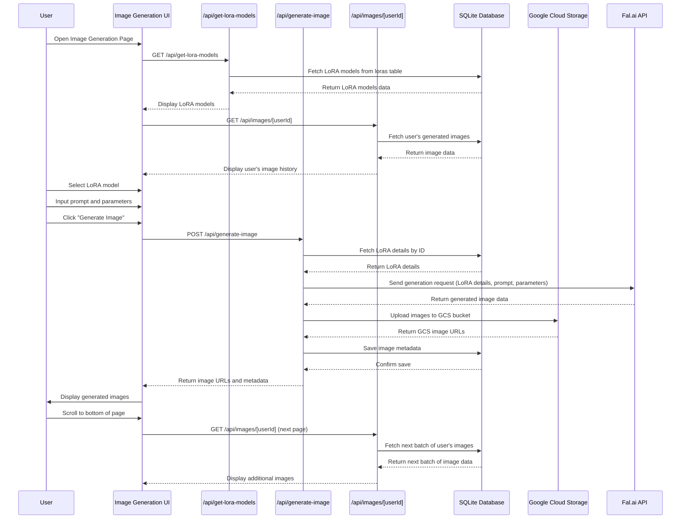

```mermaid
sequenceDiagram
    participant User
    participant UI as Image Generation UI
    participant GetLoras as /api/get-lora-models
    participant GenImage as /api/generate-image
    participant GetImages as /api/images/[userId]
    participant DB as SQLite Database
    participant GCS as Google Cloud Storage
    participant Fal as Fal.ai API

    User->>UI: Open Image Generation Page
    UI->>GetLoras: GET /api/get-lora-models
    GetLoras->>DB: Fetch LoRA models from loras table
    DB-->>GetLoras: Return LoRA models data
    GetLoras-->>UI: Display LoRA models

    UI->>GetImages: GET /api/images/[userId]
    GetImages->>DB: Fetch user's generated images
    DB-->>GetImages: Return image data
    GetImages-->>UI: Display user's image history

    User->>UI: Select LoRA model
    User->>UI: Input prompt and parameters
    User->>UI: Click "Generate Image"
    UI->>GenImage: POST /api/generate-image
    GenImage->>DB: Fetch LoRA details by ID
    DB-->>GenImage: Return LoRA details
    GenImage->>Fal: Send generation request (LoRA details, prompt, parameters)
    Fal-->>GenImage: Return generated image data
    GenImage->>GCS: Upload images to GCS bucket
    GCS-->>GenImage: Return GCS image URLs
    GenImage->>DB: Save image metadata
    DB-->>GenImage: Confirm save
    GenImage-->>UI: Return image URLs and metadata
    UI->>User: Display generated images

    User->>UI: Scroll to bottom of page
    UI->>GetImages: GET /api/images/[userId] (next page)
    GetImages->>DB: Fetch next batch of user's images
    DB-->>GetImages: Return next batch of image data
    GetImages-->>UI: Display additional images
```