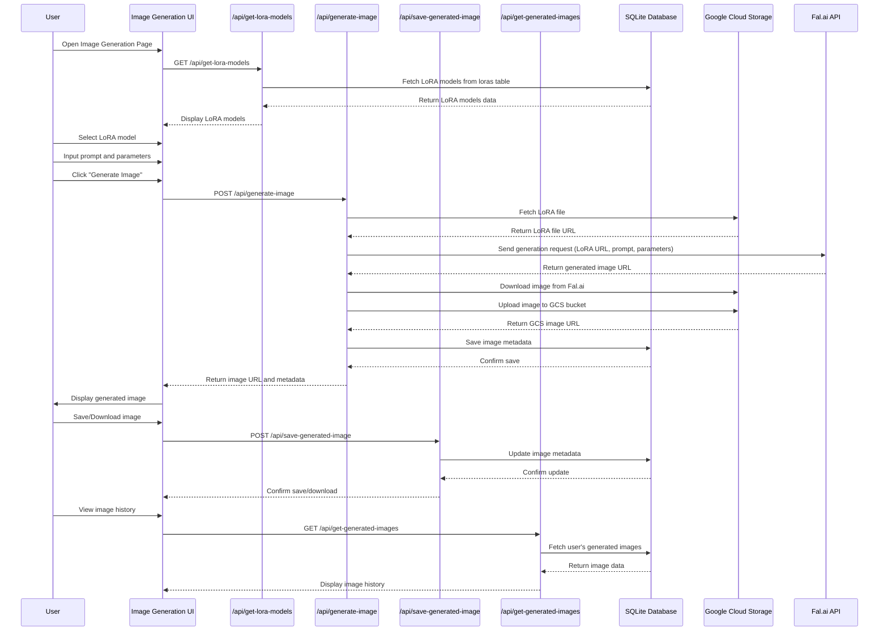

```mermaid
sequenceDiagram
    participant User
    participant UI as Image Generation UI
    participant GetLoras as /api/get-lora-models
    participant GenImage as /api/generate-image
    participant SaveImage as /api/save-generated-image
    participant GetImages as /api/get-generated-images
    participant DB as SQLite Database
    participant GCS as Google Cloud Storage
    participant Fal as Fal.ai API

    User->>UI: Open Image Generation Page
    UI->>GetLoras: GET /api/get-lora-models
    GetLoras->>DB: Fetch LoRA models from loras table
    DB-->>GetLoras: Return LoRA models data
    GetLoras-->>UI: Display LoRA models

    User->>UI: Select LoRA model
    User->>UI: Input prompt and parameters
    User->>UI: Click "Generate Image"
    UI->>GenImage: POST /api/generate-image
    GenImage->>GCS: Fetch LoRA file
    GCS-->>GenImage: Return LoRA file URL
    GenImage->>Fal: Send generation request (LoRA URL, prompt, parameters)
    Fal-->>GenImage: Return generated image URL
    GenImage->>GCS: Download image from Fal.ai
    GenImage->>GCS: Upload image to GCS bucket
    GCS-->>GenImage: Return GCS image URL
    GenImage->>DB: Save image metadata
    DB-->>GenImage: Confirm save
    GenImage-->>UI: Return image URL and metadata
    UI->>User: Display generated image

    User->>UI: Save/Download image
    UI->>SaveImage: POST /api/save-generated-image
    SaveImage->>DB: Update image metadata
    DB-->>SaveImage: Confirm update
    SaveImage-->>UI: Confirm save/download

    User->>UI: View image history
    UI->>GetImages: GET /api/get-generated-images
    GetImages->>DB: Fetch user's generated images
    DB-->>GetImages: Return image data
    GetImages-->>UI: Display image history
```