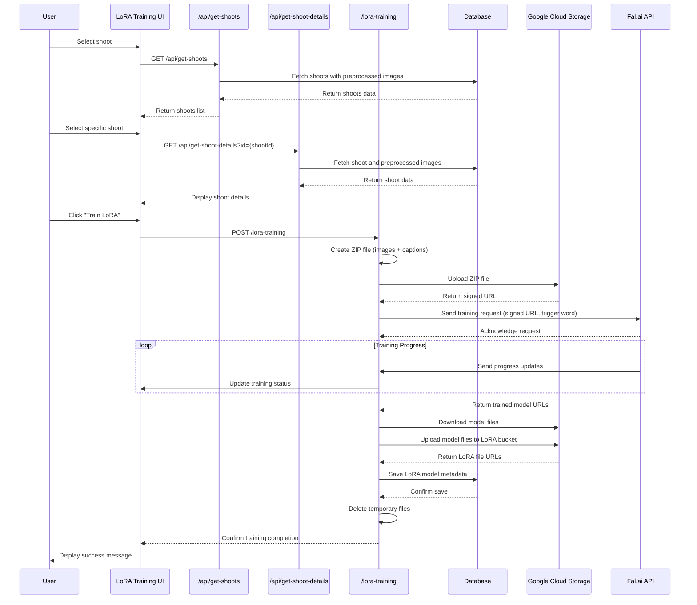

```mermaid
sequenceDiagram
    participant User
    participant UI as LoRA Training UI
    participant GetShoots as /api/get-shoots
    participant GetShootDetails as /api/get-shoot-details
    participant TrainLora as /lora-training
    participant DB as Database
    participant GCS as Google Cloud Storage
    participant Fal as Fal.ai API

    User->>UI: Select shoot
    UI->>GetShoots: GET /api/get-shoots
    GetShoots->>DB: Fetch shoots with preprocessed images
    DB-->>GetShoots: Return shoots data
    GetShoots-->>UI: Return shoots list

    User->>UI: Select specific shoot
    UI->>GetShootDetails: GET /api/get-shoot-details?id={shootId}
    GetShootDetails->>DB: Fetch shoot and preprocessed images
    DB-->>GetShootDetails: Return shoot data
    GetShootDetails-->>UI: Display shoot details

    User->>UI: Click "Train LoRA"
    UI->>TrainLora: POST /lora-training
    TrainLora->>TrainLora: Create ZIP file (images + captions)
    TrainLora->>GCS: Upload ZIP file
    GCS-->>TrainLora: Return signed URL

    TrainLora->>Fal: Send training request (signed URL, trigger word)
    Fal-->>TrainLora: Acknowledge request
    loop Training Progress
        Fal->>TrainLora: Send progress updates
        TrainLora->>UI: Update training status
    end

    Fal-->>TrainLora: Return trained model URLs
    TrainLora->>GCS: Download model files
    TrainLora->>GCS: Upload model files to LoRA bucket
    GCS-->>TrainLora: Return LoRA file URLs

    TrainLora->>DB: Save LoRA model metadata
    DB-->>TrainLora: Confirm save

    TrainLora->>TrainLora: Delete temporary files
    TrainLora-->>UI: Confirm training completion

    UI->>User: Display success message
```