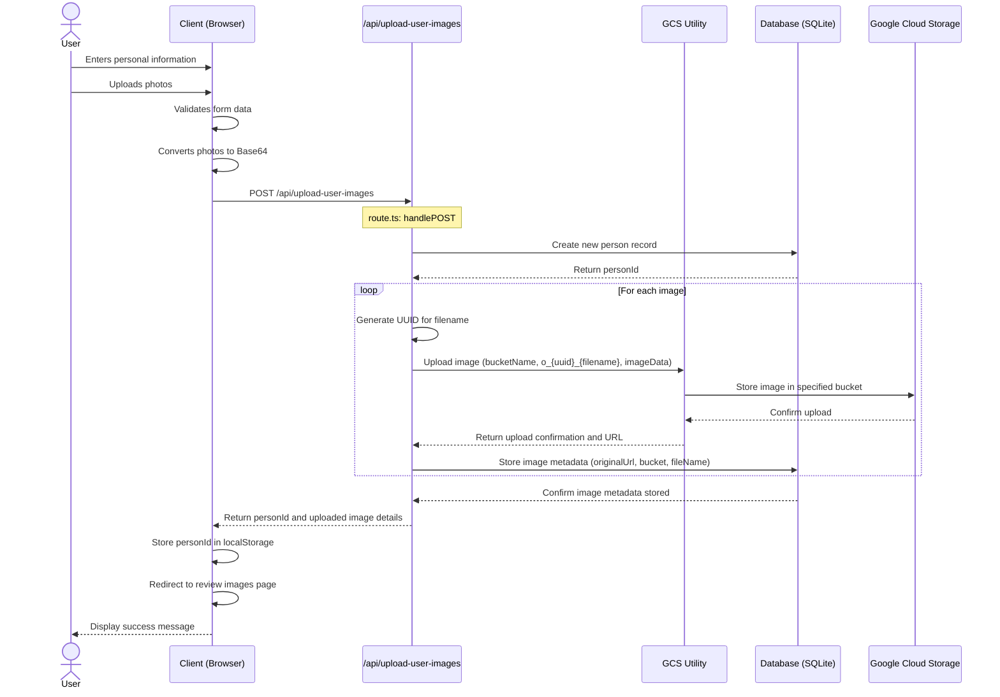

# Person Setup Sequence Diagram

## Diagram Explanation

1. The user enters their personal information and uploads photos on the client-side.
2. The client validates the form data and converts the uploaded photos to Base64 format.
3. The client sends a POST request to `/api/upload-user-images` with the personal data and Base64 encoded images.
4. The `/api/upload-user-images` API (route.ts) handles the POST request:
   - It creates a new person record in the database and receives the `personId`.
   - For each uploaded image:
     - It generates a UUID for the filename.
     - It calls the GCS utility to upload the image, passing the bucket name, filename `o_{uuid}_{filename}`, and image data.
     - The GCS utility interacts with Google Cloud Storage to store the image in the specified bucket.
     - It stores the image metadata (including the `gcs_url`, `bucket`, and `fileName`) in the database.
5. The API returns the `personId` and details of the uploaded images to the client.
6. The client stores the `personId` in localStorage and redirects the user to the review images page.
7. The client displays a success message to the user.

