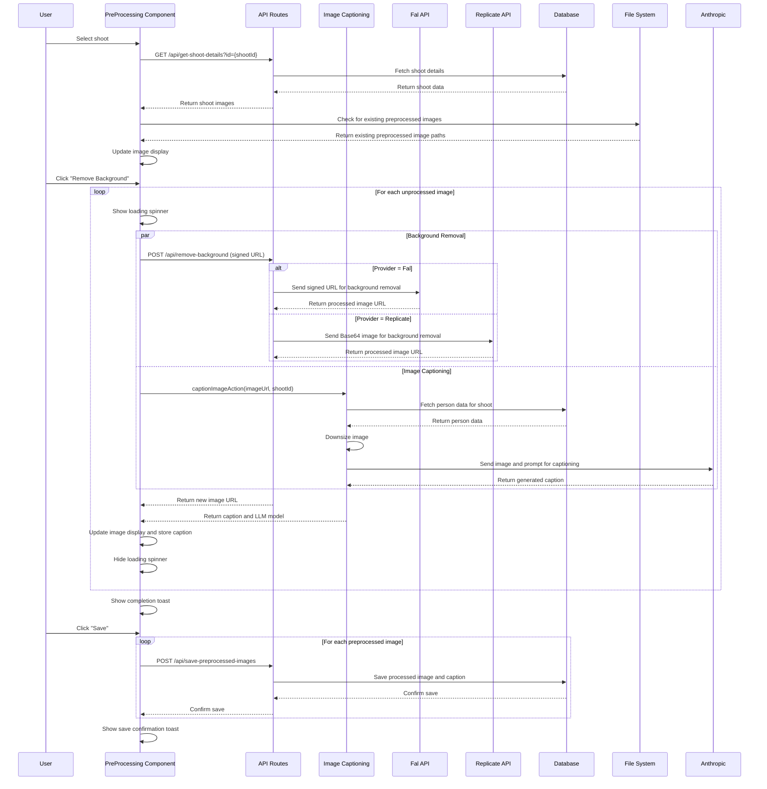

```mermaid
sequenceDiagram
    participant User
    participant UI as PreProcessing Component
    participant API as API Routes
    participant ImgCaption as Image Captioning
    participant Fal as Fal API
    participant Replicate as Replicate API
    participant DB as Database
    participant FileSystem as File System

    User->>UI: Select shoot
    UI->>API: GET /api/get-shoot-details?id={shootId}
    API->>DB: Fetch shoot details
    DB-->>API: Return shoot data
    API-->>UI: Return shoot images
    UI->>FileSystem: Check for existing preprocessed images
    FileSystem-->>UI: Return existing preprocessed image paths
    UI->>UI: Update image display

    User->>UI: Click "Remove Background"
    loop For each unprocessed image
        UI->>UI: Show loading spinner
        par Background Removal
            UI->>API: POST /api/remove-background (signed URL)
            alt Provider = Fal
                API->>Fal: Send signed URL for background removal
                Fal-->>API: Return processed image URL
            else Provider = Replicate
                API->>Replicate: Send Base64 image for background removal
                Replicate-->>API: Return processed image URL
            end
        and Image Captioning
            UI->>ImgCaption: captionImageAction(imageUrl, shootId)
            ImgCaption->>DB: Fetch person data for shoot
            DB-->>ImgCaption: Return person data
            ImgCaption->>ImgCaption: Downsize image
            ImgCaption->>Anthropic: Send image and prompt for captioning
            Anthropic-->>ImgCaption: Return generated caption
        end
        API-->>UI: Return new image URL
        ImgCaption-->>UI: Return caption and LLM model
        UI->>UI: Update image display and store caption
        UI->>UI: Hide loading spinner
    end

    UI->>UI: Show completion toast

    User->>UI: Click "Save"
    loop For each preprocessed image
        UI->>API: POST /api/save-preprocessed-images
        API->>DB: Save processed image and caption
        DB-->>API: Confirm save
        API-->>UI: Confirm save
    end
    UI->>UI: Show save confirmation toast
```