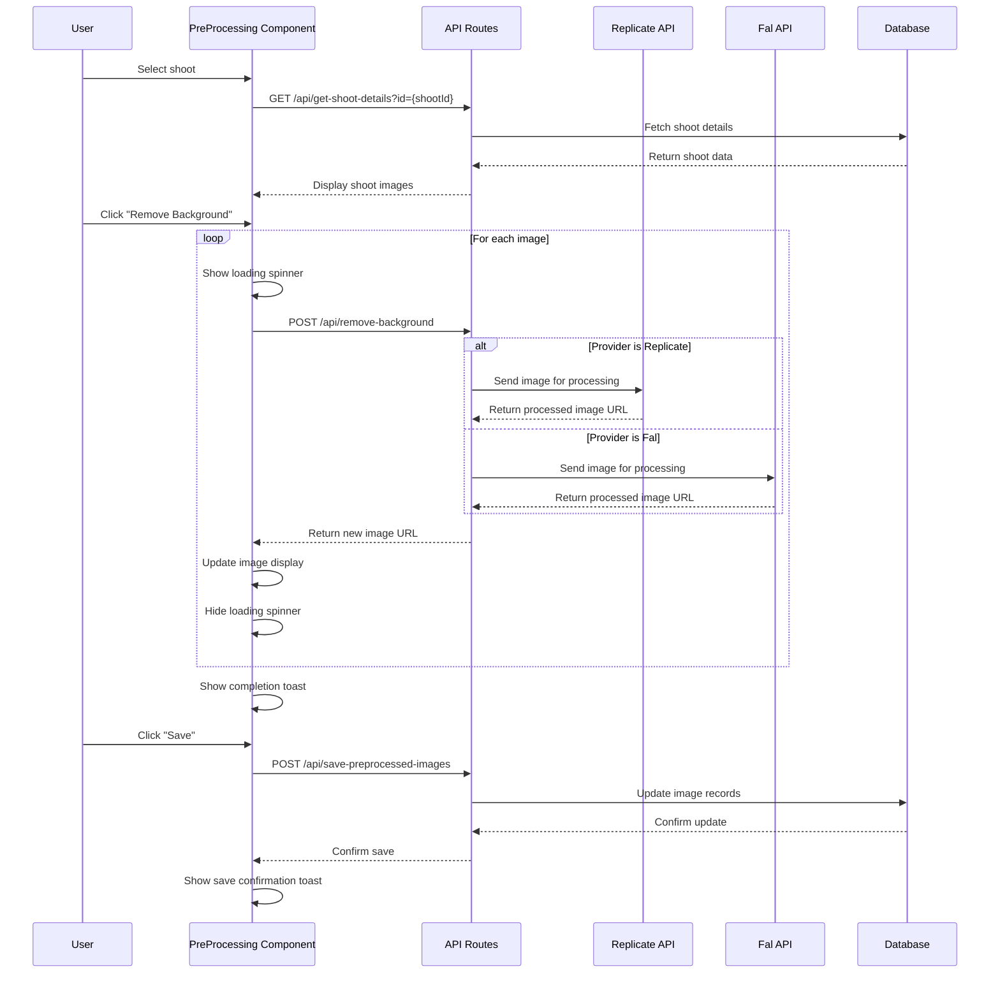

```mermaid
sequenceDiagram
    participant User
    participant UI as PreProcessing Component
    participant API as API Routes
    participant Replicate as Replicate API
    participant Fal as Fal API
    participant DB as Database

    User->>UI: Select shoot
    UI->>API: GET /api/get-shoot-details?id={shootId}
    API->>DB: Fetch shoot details
    DB-->>API: Return shoot data
    API-->>UI: Display shoot images

    User->>UI: Click "Remove Background"
    loop For each image
        UI->>UI: Show loading spinner
        UI->>API: POST /api/remove-background
        alt Provider is Replicate
            API->>Replicate: Send image for processing
            Replicate-->>API: Return processed image URL
        else Provider is Fal
            API->>Fal: Send image for processing
            Fal-->>API: Return processed image URL
        end
        API-->>UI: Return new image URL
        UI->>UI: Update image display
        UI->>UI: Hide loading spinner
    end

    UI->>UI: Show completion toast

    User->>UI: Click "Save"
    UI->>API: POST /api/save-preprocessed-images
    API->>DB: Update image records
    DB-->>API: Confirm update
    API-->>UI: Confirm save
    UI->>UI: Show save confirmation toast
```