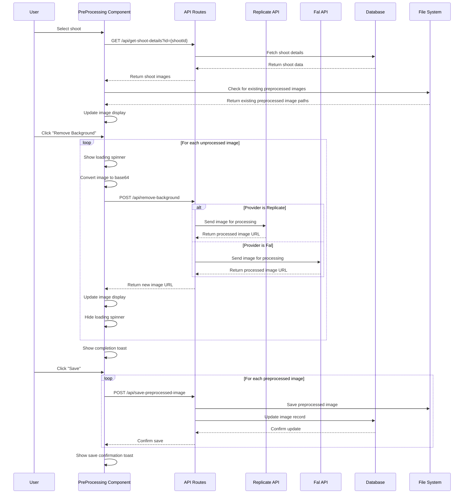

```mermaid
sequenceDiagram
    participant User
    participant UI as PreProcessing Component
    participant API as API Routes
    participant Replicate as Replicate API
    participant Fal as Fal API
    participant DB as Database
    participant FileSystem as File System

    User->>UI: Select shoot
    UI->>API: GET /api/get-shoot-details?id={shootId}
    API->>DB: Fetch shoot details
    DB-->>API: Return shoot data
    API-->>UI: Return shoot images
    UI->>FileSystem: Check for existing preprocessed images
    FileSystem-->>UI: Return existing preprocessed image paths
    UI->>UI: Update image display

    User->>UI: Click "Remove Background"
    loop For each unprocessed image
        UI->>UI: Show loading spinner
        UI->>UI: Convert image to base64
        UI->>API: POST /api/remove-background
        alt Provider is Replicate
            API->>Replicate: Send image for processing
            Replicate-->>API: Return processed image URL
        else Provider is Fal
            API->>Fal: Send image for processing
            Fal-->>API: Return processed image URL
        end
        API-->>UI: Return new image URL
        UI->>UI: Update image display
        UI->>UI: Hide loading spinner
    end

    UI->>UI: Show completion toast

    User->>UI: Click "Save"
    loop For each preprocessed image
        UI->>API: POST /api/save-preprocessed-image
        API->>FileSystem: Save preprocessed image
        API->>DB: Update image record
        DB-->>API: Confirm update
        API-->>UI: Confirm save
    end
    UI->>UI: Show save confirmation toast
```