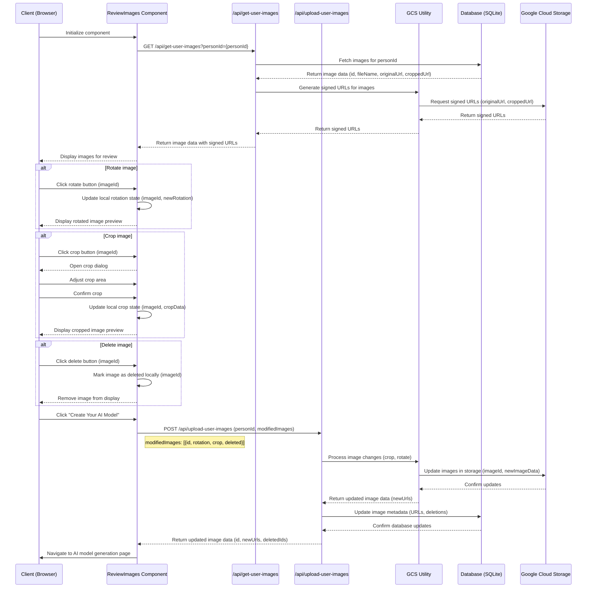

# Review Images Sequence Diagram

## Notes on Implementation

1. **Local State Management**: The `ReviewImages` component needs to implement local state management for rotations, crops, and deletions. This state should include:
   - `imageId`
   - `rotation` (degrees)
   - `crop` (x, y, width, height)
   - `deleted` (boolean)

2. **Image Display**: The component should apply local rotations and crops when displaying images to the user.

3. **Revert Changes**: Consider adding functionality to revert local changes before final submission.

4. **Batch Update API**: Implement the `/api/upload-user-images` endpoint to handle batch updates of image modifications. The payload should include:
   - `personId`
   - Array of modified images with their `id`, `rotation`, `crop`, and `deleted` status

5. **Error Handling**: Implement comprehensive error handling for the batch update process, including GCS operations and database updates.

6. **Performance**: Consider optimizing the batch update process for large numbers of images, possibly using parallel processing or chunked updates.

7. **User Feedback**: Provide clear feedback to the user during the update process and navigation to the AI model generation page.

These changes ensure that all modifications are kept client-side until the user decides to create their AI model, at which point all changes are sent to the server in a single batch update. The diagram now clearly shows the key data being passed between components at each step of the process.
