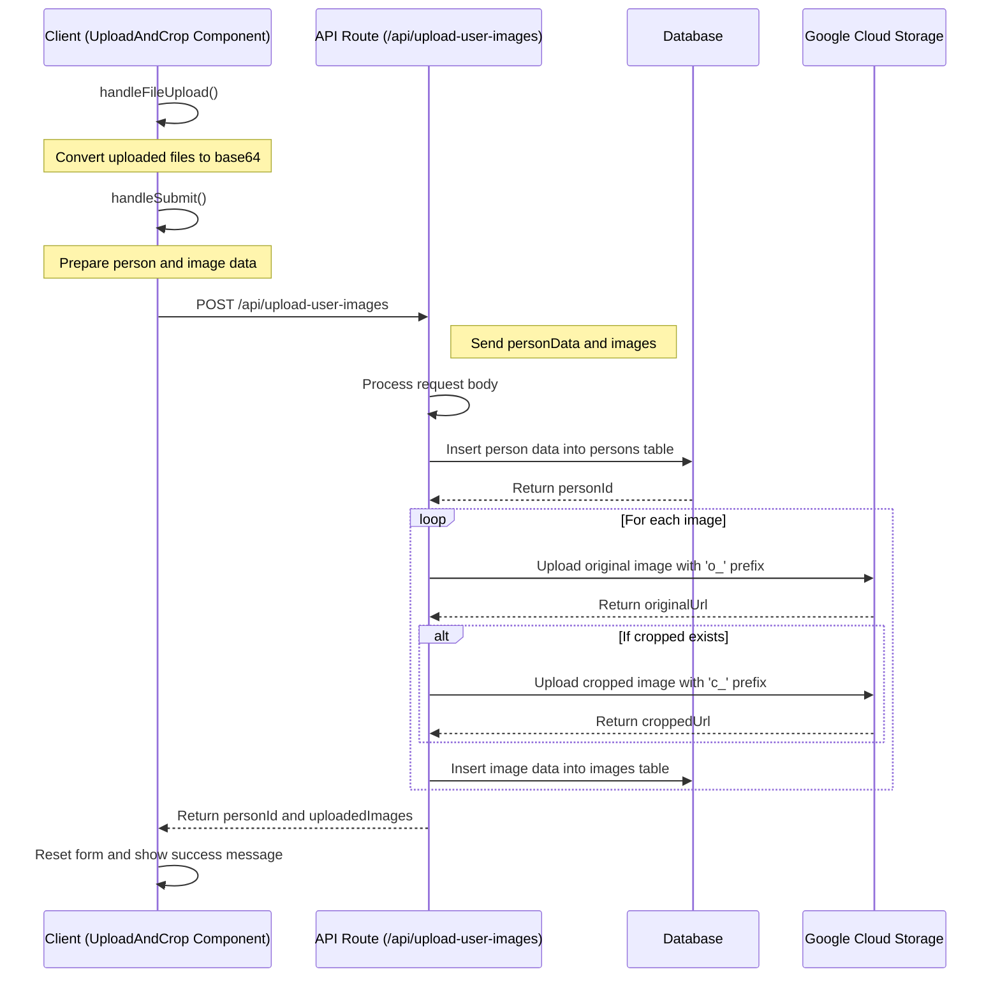

```mermaid
sequenceDiagram
    participant Client as Client (UploadAndCrop Component)
    participant API as API Route (/api/upload-user-images)
    participant DB as Database
    participant GCP as Google Cloud Storage

    Client->>Client: handleFileUpload()
    Note over Client: Convert uploaded files to base64

    Client->>Client: handleSubmit()
    Note over Client: Prepare person and image data

    Client->>API: POST /api/upload-user-images
    Note right of API: Send personData and images

    API->>API: Process request body
    
    API->>DB: Insert person data into persons table
    DB-->>API: Return personId

    loop For each image
        API->>GCP: Upload original image with 'o_' prefix
        GCP-->>API: Return originalUrl
        alt If cropped exists
            API->>GCP: Upload cropped image with 'c_' prefix
            GCP-->>API: Return croppedUrl
        end
        API->>DB: Insert image data into images table
    end

    API-->>Client: Return personId and uploadedImages

    Client->>Client: Reset form and show success message
```