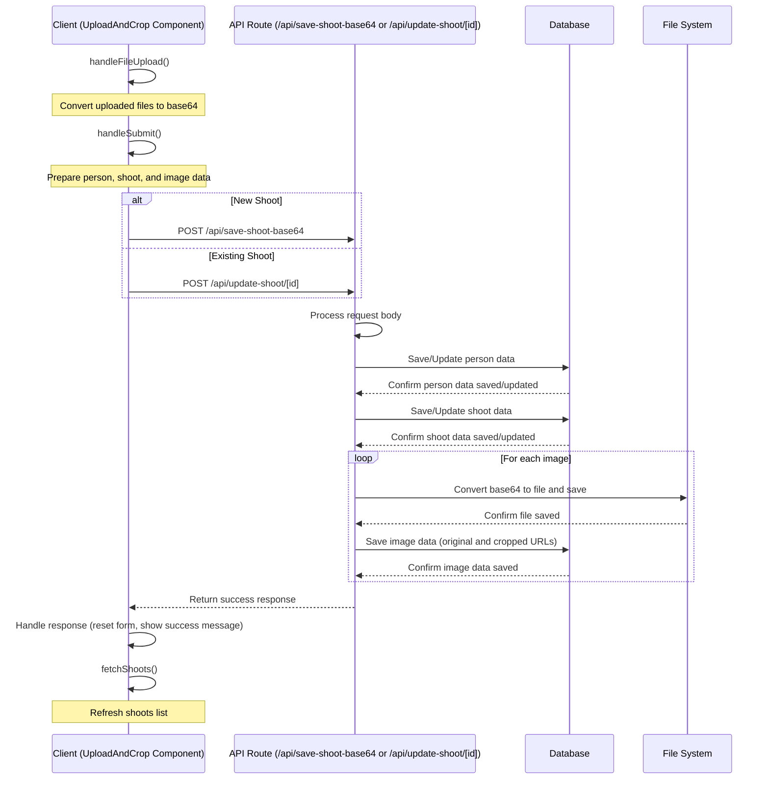

```mermaid
sequenceDiagram
    participant Client as Client (UploadAndCrop Component)
    participant API as API Route (/api/save-shoot-base64 or /api/update-shoot/[id])
    participant DB as Database
    participant FS as File System

    Client->>Client: handleFileUpload()
    Note over Client: Convert uploaded files to base64

    Client->>Client: handleSubmit()
    Note over Client: Prepare person, shoot, and image data

    alt New Shoot
        Client->>API: POST /api/save-shoot-base64
    else Existing Shoot
        Client->>API: POST /api/update-shoot/[id]
    end

    API->>API: Process request body
    
    API->>DB: Save/Update person data
    DB-->>API: Confirm person data saved/updated

    API->>DB: Save/Update shoot data
    DB-->>API: Confirm shoot data saved/updated

    loop For each image
        API->>FS: Convert base64 to file and save
        FS-->>API: Confirm file saved
        API->>DB: Save image data (original and cropped URLs)
        DB-->>API: Confirm image data saved
    end

    API-->>Client: Return success response

    Client->>Client: Handle response (reset form, show success message)
    Client->>Client: fetchShoots()
    Note over Client: Refresh shoots list
```