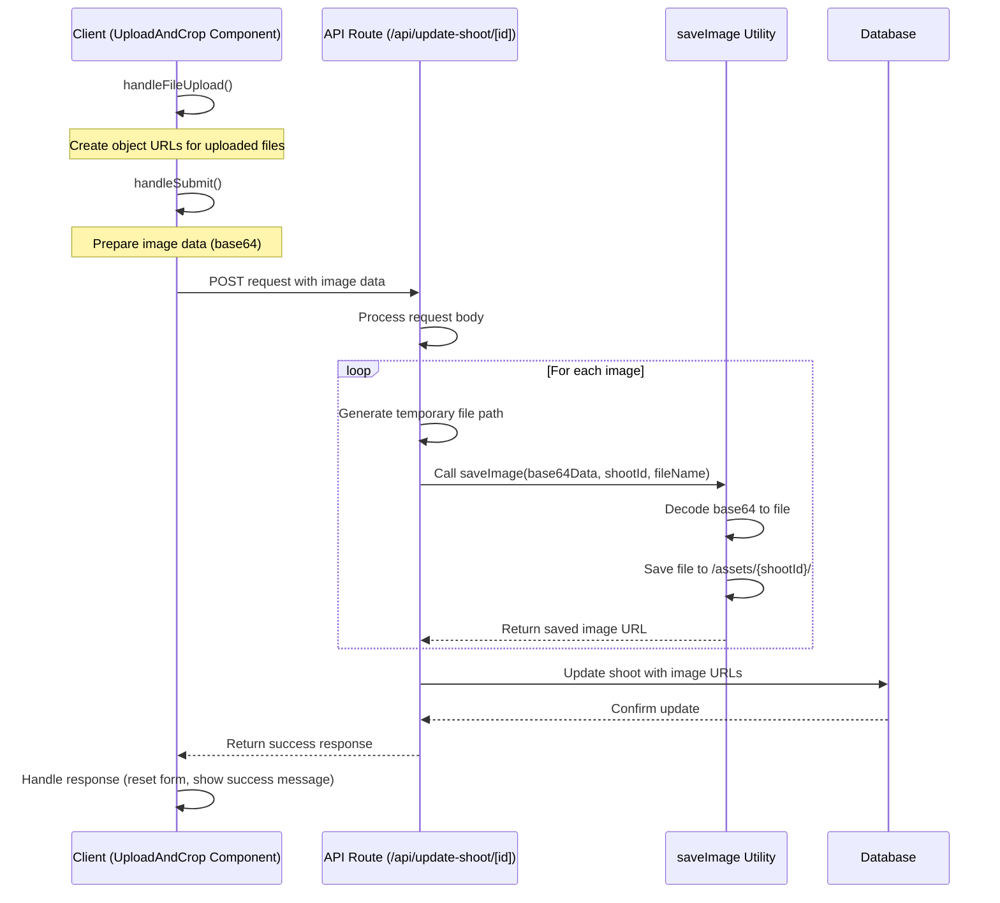

```mermaid
sequenceDiagram
    participant Client as Client (UploadAndCrop Component)
    participant API as API Route (/api/update-shoot/[id])
    participant SaveImage as saveImage Utility
    participant DB as Database

    Client->>Client: handleFileUpload()
    Note over Client: Create object URLs for uploaded files

    Client->>Client: handleSubmit()
    Note over Client: Prepare image data (base64)

    Client->>API: POST request with image data
    API->>API: Process request body
    
    loop For each image
        API->>API: Generate temporary file path
        API->>SaveImage: Call saveImage(base64Data, shootId, fileName)
        SaveImage->>SaveImage: Decode base64 to file
        SaveImage->>SaveImage: Save file to /assets/{shootId}/
        SaveImage-->>API: Return saved image URL
    end

    API->>DB: Update shoot with image URLs
    DB-->>API: Confirm update
    API-->>Client: Return success response

    Client->>Client: Handle response (reset form, show success message)
```