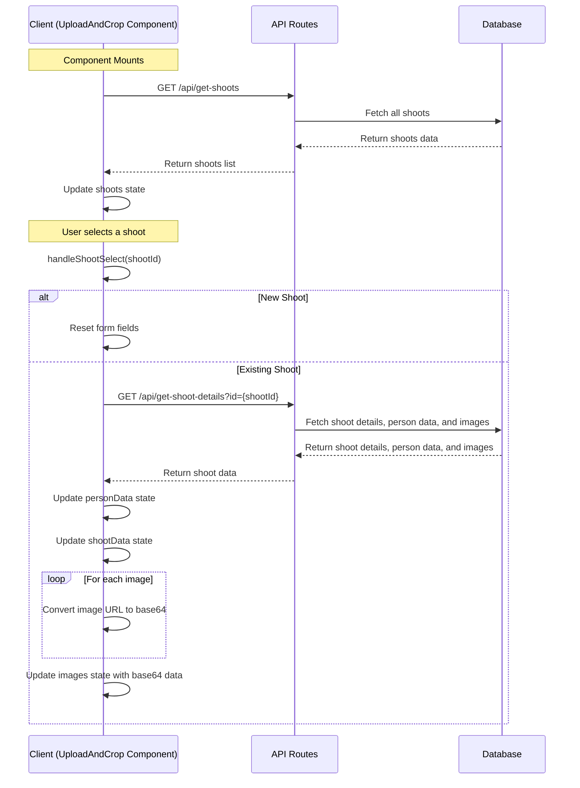

```mermaid
sequenceDiagram
    participant Client as Client (UploadAndCrop Component)
    participant API as API Routes
    participant DB as Database

    Note over Client: Component Mounts
    Client->>API: GET /api/get-shoots
    API->>DB: Fetch all shoots
    DB-->>API: Return shoots data
    API-->>Client: Return shoots list
    Client->>Client: Update shoots state

    Note over Client: User selects a shoot
    Client->>Client: handleShootSelect(shootId)
    alt New Shoot
        Client->>Client: Reset form fields
    else Existing Shoot
        Client->>API: GET /api/get-shoot-details?id={shootId}
        API->>DB: Fetch shoot details, person data, and images
        DB-->>API: Return shoot details, person data, and images
        API-->>Client: Return shoot data
        Client->>Client: Update personData state
        Client->>Client: Update shootData state
        loop For each image
            Client->>Client: Convert image URL to base64
        end
        Client->>Client: Update images state with base64 data
    end
```
